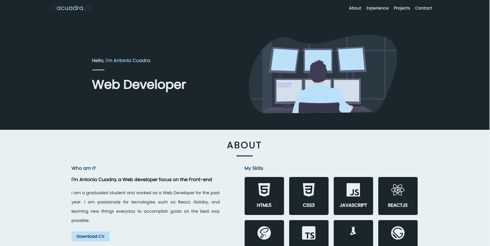

# My Portfolio

## Description

This is my profesional portfolio, here you can find information about me, my skills, my projects and my contact information.

- It is using gatsby and tailwindcss with some plugis
- Its using JSON for the projects and the tags
- The images have lazy loading
- The css is processing with postCSS and purgeCSS

If you want to see it in real time use this url: https://www.acuadraq.tech/
